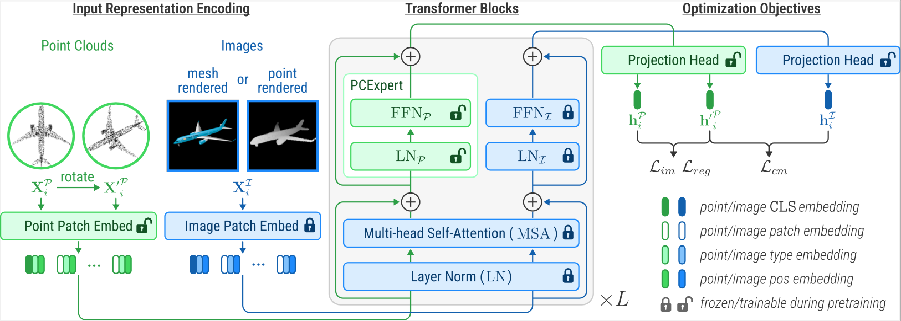

# PCExpert
> [**Point Clouds Are Specialized Images: A Knowledge Transfer Approach for 3D Understanding**](https://arxiv.org/abs/2307.15569) <br>
> Jiachen Kang, Wenjing Jia, Xiangjian He, and Kin Man Lam <br>


This repository contains the code implementation of paper **Point Clouds Are Specialized Images: A Knowledge Transfer Approach for 3D Understanding**.


## Abstract

Self-supervised representation learning (SSRL) has gained increasing attention in point cloud understanding, in addressing the challenges posed by 3D data scarcity and high annotation costs.This paper presents PCExpert, a novel SSRL approach that reinterprets point clouds as "specialized images". This conceptual shift allows PCExpert to leverage knowledge derived from large-scale image modality in a more direct and deeper manner, via extensively sharing the parameters with a pre-trained image encoder in a multi-way Transformer architecture. The parameter sharing strategy, combined with an additional pretext task for pre-training, i.e., transformation estimation, empowers PCExpert to outperform the state of the arts in a variety of tasks, with a remarkable reduction in the number of trainable parameters. Notably, PCExpert's performance under LINEAR fine-tuning (e.g., yielding a 90.02% overall accuracy on ScanObjectNN) has already closely approximated the results obtained with FULL model fine-tuning (92.66%), demonstrating its effective representation capability. 

<div  align="center">    
 
</div>


## Environment

This codebase was tested with the following environment configurations. It may work with other versions.
- RHEL 8.6
- CUDA 11.6
- GCC 8.5.0
- Python 3.9.16
- PyTorch 1.13


## Datasets

ShapeNet, ScanObjectNN, ModelNet40 are used in this work. For detailed instructions on how to download and store these datasets, please refer to [Point-BERT](https://github.com/lulutang0608/Point-BERT/blob/49e2c7407d351ce8fe65764bbddd5d9c0e0a4c52/DATASET.md).


## Pre-training

Training on mesh-rendered images:

```shell
python run.py with pcd_render=False batch_size=1024 image_size=224 patch_size=16 shapenet_npoints_sample=2048 width=768 output_dim=256 
```

Training on point-cloud-rendered images:

```shell
python run.py with pcd_render=True batch_size=1024 image_size=224 patch_size=16 shapenet_npoints_sample=2048 width=768 output_dim=256
```

## Fine-tuning

```shell
python ft.py with finetune_linear_sonn ckpt_path=<path_to_ckpt>
```


## License
Our code is released under the MIT License.

## Acknowledgements
This repository is built upon [VLMo](https://github.com/microsoft/unilm/tree/master/vlmo), [CLIP](https://github.com/openai/CLIP), 
[ACT](https://github.com/RunpeiDong/ACT), and [Point-BERT](https://github.com/lulutang0608/Point-BERT).
